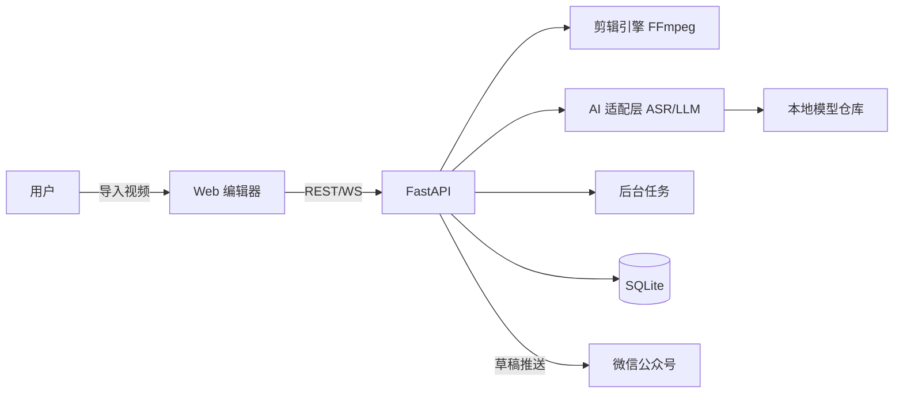
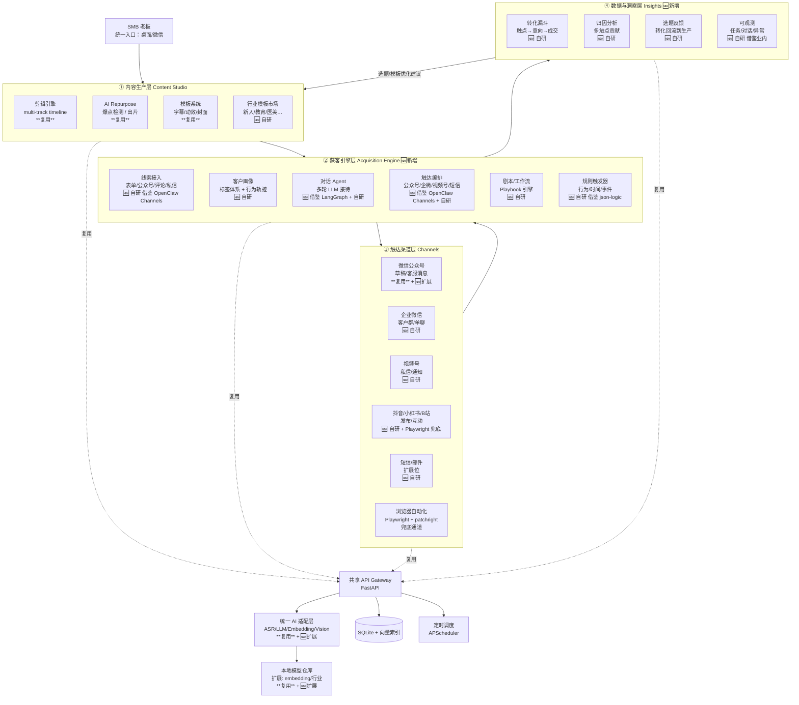
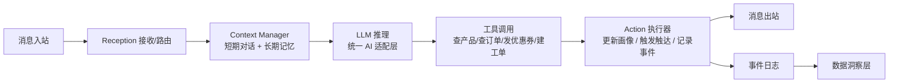

> **状态**：方案阶段（不动代码，先敲定方向）
> **日期**：2026-09-27
> **文档版本**：v1.4
> **变更日志**：
> - v1.4（2026-09-27）M1 实施完成（见上方 changelog）
> - v1.3（2026-09-27）品牌口径统一修订：所有「经营平台」改为「运营平台」（用户确认口径变更：SMB AI Operating Platform → 吴桐荟运营平台）
> - v1.2（2026-09-27）OpenClaw 调研结论 + 全量品牌收敛 + 命名规范 + 模块「复用/借鉴/自研」标注

> **v1.4（2026-09-27）M1 实施完成**
> - 后端：FastAPI + 22 个 API 端点（`/api/v1/wth/*` 命名空间）
> - 后端：SQLite + 迁移系统 + 9 张表（含 `wth_leads` / `wth_conversations` / `wth_outreach_log` 等）
> - 后端：channels 适配器层（`MockAdapter` + `WechatMpAdapter`，注册表模式）
> - 后端：jobs 任务调度（asyncio 后台 + ProgressBus + WebSocket 推送）
> - 后端：完整剪链路 `pipeline.py`（上传 → ASR → 爆点 → FFmpeg → 发布）
> - 后端：5 个线索适配器（`FormAdapter` / `MpCommentAdapter` / `MpPrivateAdapter` / `VideoCommentAdapter` / `MockAdapter`）
> - 前端：6 个 Vue 视图（Home / Editor / Leads / Agent / Playbook / Funnel）实装 + i18n + 路由 + API client + WebSocket helper
> - 验证：`tests/smoke_e2e.py` 全部通过；前端 `vue-tsc --noEmit` 零错
> - 下一步：M2 触达渠道扩展 + M3 剧本编排

---

## 0. 项目元信息与待澄清事项

### 0.1 当前实物盘点（2026-09-27 实地核对）

| 路径 / 对象 | 内容 | 状态 |
|------|------|------|
| `/Users/apple/Desktop/AI项目文件夹/自媒体运营平台/` | 源码根（server/web/sdk/docs/...） | ✅ Git 仓库，已推 GitHub v0.26.0 |
| `/Users/apple/Desktop/AI项目文件夹/【中小微企业获客平台】-吴桐荟/` | **v0.26.0 安装包 ×4 + 安装说明.txt** | 📦 构建产物目录，新项目根 |
| `ssj198807-maker/self-media-platform` | MIT License, LatestRelease v0.26.0 | ✅ GitHub 已发布 |
| `pyproject.toml` | `name = "clipforge"`, Python ≥3.11, FastAPI 0.110+ | ⚠️ 待迁移到 `wutonghui` 包名 |
| 品牌 | 源码 = 「吴桐荟剪辑」（过渡品牌），新阶段收敛为「**吴桐荟运营平台**」 | ✅ 本次统一收敛 |

### 0.2 待用户拍板的决策点

| # | 决策点 | 建议默认值 | 需要你确认 |
|----|-------|----------|-----------|
| 1 | 新目录的角色 | 新项目根（仅放方案 + 未来 README 草案），源码仍留在 `自媒体运营平台/` | ✅ / ❌ |
| 2 | 许可证统一（GitHub LICENSE=MIT，安装说明.txt=AGPL-3.0） | **统一为 MIT** | ✅ / ❌ |
| 3 | 仓库是否迁址 | 保持 `self-media-platform`，重命名 + description 更新 | ✅ / ❌ |
| 4 | 品牌口径 | 单品牌「**吴桐荟运营平台**」，覆盖剪辑 + 获客全场景 | ✅ / ❌ |
| 5 | 域名 | `<待你确认>.com` 占位 | ❓ 请指定 |
| 6 | 是否基于 OpenClaw fork | **否**（见 §0.5 调研结论），走自研 + 借鉴架构 | ✅ / ❌ |

### 0.3 路径与命名约定

- **源码根**（沿用）：`/Users/apple/Desktop/AI项目文件夹/自媒体运营平台/`
- **新项目根**（本目录）：`/Users/apple/Desktop/AI项目文件夹/【中小微企业获客平台】-吴桐荟/`
- **GitHub**：`ssj198807-maker/self-media-platform`
- **品牌名（本次统一收敛）**：「**吴桐荟运营平台**」（简称「吴桐荟」/ WutongHui）
- **代码前缀**：`wutonghui-`（环境变量 / IPC 频道 / 数据表 / localStorage 键 / API 路径前缀）
- **本方案文档路径**：`/Users/apple/Desktop/AI项目文件夹/【中小微企业获客平台】-吴桐荟/docs/ai-agent-upgrade-plan.md`

### 0.4 许可证与归属（统一方案）

| 项 | 当前 | 建议统一为 |
|----|------|-----------|
| GitHub 仓库 LICENSE | MIT | ✅ **MIT**（保留） |
| 安装说明.txt | AGPL-3.0-only | ⚠️ 改为 MIT |
| 版权声明 | 源码 © 吴桐荟运营平台 Contributors | ✅ 沿用 |
| GitHub description | 「吴桐荟剪辑 — AI 自媒体运营工作站…」 | 🔄 改为「吴桐荟运营平台 — SMB AI 运营平台」 |

**LICENSE 选型理由**：
- ✅ **MIT** — 与 GitHub LICENSE 一致；最大可分享性；与我们的"免费工具/平台 + 朋友可分享"定位契合
- ⚠️ **Apache 2.0** — 也可考虑，但需给每位贡献者加 NOTICE 文件
- ❌ **AGPL-3.0** — 强 copyleft，与"可分享给朋友"诉求冲突（朋友二次分发受限）

### 0.5 OpenClaw 调研结论与可行性判断

> 来源：[github.com/openclaw/openclaw](https://github.com/openclaw/openclaw) README（2026-09-27 实地抓取）

#### OpenClaw 是什么

| 维度 | 真相 |
|------|------|
| **定位** | "The AI that really does things. Any OS. Any Platform. 🦞" — **通用个人 AI 助手框架** |
| **核心架构** | **Gateway 控制平面** + **Channels 接入**（WhatsApp/Telegram/Slack/Discord 等 20+）+ **Tools/Skills/Plugins 扩展** + **多模型插件化** |
| **技术栈** | **Node.js 24.16+ / TypeScript / pnpm workspace** |
| **协议** | **MIT © OpenClaw Foundation**（501(c)(3) 非营利治理，无付费层、无托管服务、无代币） |
| **隐私** | 状态/记忆/凭证全本地；默认仅做匿名版本检查 |

#### xiaobei 与 OpenClaw 的边界

xiaobei 是 OpenClaw 的**私有 fork**：
- `openclaw/` 目录 = OpenClaw 上游（git clone，禁止修改）
- `crews/` `skills/` `patches/` `config-templates/` `scripts/` = 私有二次开发

#### 我们的可行性判断（3 个核心问题）

| 问题 | 结论 |
|------|------|
| **能否直接基于 OpenClaw fork？** | ❌ **不推荐**。OpenClaw 是 Node.js/TS 个人助手框架，我们是 Python/FASTAPI 的 SMB 运营平台，技术栈与场景双重冲突。直接 fork 会废弃现有 0.26.0 生产代码，工作量巨大。 |
| **能否借鉴 OpenClaw 的架构思想？** | ✅ **强烈推荐**。Gateway 控制平面 / Channels 接入抽象 / Tools/Skills/Plugins 扩展 / 配置驱动 / 隐私优先 — 这些设计模式**完全不依赖 Node.js**，可用 FastAPI + Channels 子目录 + acquisition/ 子目录实现。 |
| **能否借鉴 xiaobei 的私有资产？** | ⚠️ **有限可借鉴**。Crews 多 Agent、camoufox 浏览器栈、Smart Search 是绑死在 xiaobei 私域生态（微信群/品牌信任/私有社区）的，**不能直接复制**。但其设计思路（事件驱动 Agent + 反指纹浏览器 + 零 Key 信息聚合）可作为公开技术资料参考。 |

#### 推荐路径

| 路径 | 工作量 | 风险 | 推荐度 |
|------|--------|------|--------|
| **路径 A：自研 + 借鉴架构** | 中（继承现有 0.26.0 继续演进） | 低 | ⭐⭐⭐⭐⭐ **推荐** |
| **路径 B：fork OpenClaw 后改 Python 移植** | 极高（废弃现有 0.26.0） | 高 | ❌ 不推荐 |
| **路径 C：借鉴 xiaobei 私有资产** | 高（涉及版权与品牌私有化） | 高 | ❌ 不推荐 |
| **路径 D：混合（OpenClaw 做消息网关 + Python 做业务）** | 高（双技术栈运维复杂） | 中 | ⚠️ 特定场景可考虑（如需大量通道） |

详见 §1.4「最大可借力 vs 必须自研」。

---

## 1. 背景与目标

### 1.1 现状

吴桐荟运营平台 v0.26.0 已于 2026-08 发布（GitHub Releases + Mac/Win 四包构建完成），**当前阶段主线能力是 AI 视频剪辑二创 + 微信公众号草稿自动发布**，覆盖从素材导入 → AI 爆点检测 → 多风格模板出片 → 推送到公众号草稿箱的完整链路。

但单一「剪辑工具」的天花板明显：
- **商业模式偏薄**：变现点几乎只有"省剪辑时间"，难以支撑 SMB 长期付费
- **客户视角缺失**：当前只到"产内容"，没有"承接内容 → 识别意向客户 → 跟进转化"的闭环
- **复用度受限**：已有的 ASR/LLM/模板/自动发布能力，仅服务剪辑场景，价值密度低
- **技术栈单一**：当前是 Python（FastAPI + SQLite + FFmpeg + Vue3），缺乏消息网关、多 Agent 协作、多渠道接入抽象

### 1.2 目标

将产品从 **「视频剪辑工具」** 演进为 **「面向中小微企业的 AI 运营平台」**（SMB AI Operating Platform），核心命题：

> **让 SMB 老板只需要一台机器 + 一个统一入口，就能跑通"内容自动生产 → 多渠道触达 → 智能承接 → 转化回流"的全链路经营闭环。**

升级后产品的核心场景：

| 链路环节 | 描述 | 借鉴来源 |
|---------|------|---------|
| 1. 内容生产 | ✅ 已具备：剪辑二创、自动出片、模板系统、文章生成 | 自研 |
| 2. 多渠道分发 | 🆕 抖音 / 小红书 / B站 / 视频号等多平台自动发布 | 借鉴 OpenClaw Channels 设计 |
| 3. 线索采集 | 🆕 表单 / 公众号 / 视频评论 / 私信多源线索统一接入 | 自研适配器 |
| 4. 智能承接 | 🆕 基于 LLM 的多轮对话 Agent，7×24 自动接待 | 借鉴 LangGraph / OpenClaw 架构 |
| 5. 客户跟进 | 🆕 触达编排引擎，自动跟进未转化线索 | 自研 + 借鉴 xiaobei 编排思路 |
| 6. 转化漏斗 | 🆕 漏斗分析 + 归因 + ROI 看板 | 自研 |
| 7. 数据回流 | 🆕 把转化数据回流到内容生产端，指导下一轮选题 | 自研 |

### 1.3 关键约束

- **不破坏现有**：剪辑核心链路不因升级而停摆，老用户路径不打断
- **本地优先**：延续「数据本地处理」原则，线索/客户数据不上云（除非用户显式接入云端 LLM）
- **复用最大化**：已建好的 ASR/LLM 适配层、模板系统、自动发布链路优先复用
- **可演进**：M0-M5 分阶段交付，每个阶段都有可演示的功能切片
- **品牌统一**：本阶段起统一使用「**吴桐荟运营平台**」品牌口径
- **不自造轮子**：借鉴开源生态（OpenClaw 架构思想、LangGraph、Playwright 等），不直接 fork 任何上游项目
- **免费可分享**：最终交付物是「我自己能跑、朋友能装、能用、不收费」的轻量化产品

### 1.4 最大可借力 vs 必须自研

#### ✅ 借鉴架构思想（无需 fork 代码）

| OpenClaw / 业内设计 | 我们的对标借鉴 |
|---------------------|--------------|
| Gateway 控制平面 | FastAPI 服务层（已具备） |
| Channels 接入抽象 | `server/wutonghui/channels/`（多平台触达适配器，M2 落地） |
| Tools/Skills/Plugins 扩展 | `server/wutonghui/acquisition/` + `templates/playbooks/`（剧本即 Skill） |
| 配置驱动 | `pyproject.toml` + `.env` + JSON 配置文件（沿用） |
| 隐私优先 | 凭证本地加密 + 数据本地处理（已具备） |
| 多模型插件化 | 10 家 LLM 适配层（已具备）+ 加 embedding/vision |

#### ✅ 借鉴公开组件（业内通用，无需依赖特定项目）

| 组件 | 协议 | 用途 |
|------|------|------|
| **FFmpeg** | LGPL | 已具备（剪辑引擎） |
| **sherpa-onnx** | Apache 2.0 | 已具备（ASR） |
| **LangGraph** | MIT | 多 Agent 编排（M1） |
| **smolagents** | Apache 2.0 | 多 Agent 框架（M1 备选） |
| **Playwright** + **patchright** | Apache 2.0 | 浏览器自动化 + 反指纹（M2 兜底） |
| **LlamaIndex** | MIT | RAG 框架（M1） |
| **APScheduler** | MIT | 定时调度 |
| **structlog** | MIT/Apache | 结构化日志 |

#### ❌ 必须自研的部分（场景独有）

1. **本地剪辑引擎**（声明式时间线 JSON Schema + FFmpeg 渲染器）
2. **本地模型仓库管理**（9 个模型一键下载 + 模型版本化）
3. **SMB 经营剧本库**（教育/医美/法律/电商 行业模板）
4. **桌面 GUI 编辑器**（Vue3 多轨时间线）
5. **转化漏斗与归因**（SMB 场景专属）
6. **公众号/视频号/抖音 SMB 触达编排**（中文生态）

---

## 2. 行业资料附录：同类方案对标

> 本节为业内同类方案的客观描述，仅作技术对标用，**不构成从属或衍生关系**。吴桐荟运营平台采用自研架构，独立演进。

### 2.1 业内同类项目对比

| 项目 | 定位 | 技术栈 | 开源协议 | 商业模式 | 与我们差异 |
|------|------|--------|---------|---------|----------|
| **OpenClaw** | 通用个人 AI 助手框架 | Node.js + TypeScript + pnpm | **MIT** | 无（基金会治理） | 我们是 SMB 运营平台，不是个人助手；我们是 Python |
| **xiaobei**（TeamWiseFlow） | SMB 自媒体获客智能体 | Node.js + OpenClaw fork + camoufox | MIT（4.2+ 起非纯 MIT） | VIP Club 168 元/年 + 代理 + 定制 | 强依赖微信生态 + 国内自媒体语境；**大量私有资产绑死私域** |
| **Coze**（字节跳动） | AI Bot / Agent 平台 | 云端 | 部分开源 | SaaS 订阅 | 我们主打本地部署 |
| **Dify** | LLM 应用编排平台 | Python + 云端 | 部分开源 | SaaS + 私有 | 我们更聚焦 SMB 经营场景 |
| **Botpress** | 对话机器人平台 | Node.js + 云端 | 部分开源 | SaaS 订阅 | 我们含内容生产 |
| **Lindy** | 个人 AI 助手 | 云端 | 闭源 | SaaS 高价 | 我们含本地剪辑 |

### 2.2 业内主流技术架构模式（公开范式）

| 层 | 业内常见做法 | 给吴桐荟的启发 |
|----|---------------|--------------|
| **底层引擎** | 个人 AI 助手框架（fork 自某开源项目） | 我们用现成的 LangGraph / smolagents 等开源组件即可，避免 fork |
| **多 Agent 协作** | Crew / Worker 机制扁平化模板 | 我们做"功能化工作流编排"（剧本引擎）更实用 |
| **浏览器自动化** | 反指纹浏览器 + session profile 持久化 | 用 Playwright + patchright（Apache 2.0 反指纹 fork） |
| **LLM 适配** | 一套餐方案（阿里云百炼 Token Plan 等） | 沿用用户已有的 10 家 LLM 适配层 |
| **记忆系统** | FTS 全文检索（默认）+ embedding（可选） | sqlite-vss + 渐进增强 |
| **安装/升级** | 一行 curl 脚本 + 双线路下载 | 沿用当前电子安装包 + 国内镜像 |
| **目录职责** | 程序目录 / 数据目录分离 | 沿用 |

### 2.3 吴桐荟的差异化护城河

| 维度 | 业内常见短板 | 吴桐荟的优势 |
|------|-------------|------------|
| **本地化生产** | 多数方案无本地剪辑引擎、无本地 ASR、无本地模型仓库 | ✅ 已有 FFmpeg + 9 个本地模型 + ASR |
| **数据闭环** | 内容生产与客户转化多为割裂的两套系统 | ✅ 设计 "转化回流到选题" 闭环 |
| **桌面 GUI** | 多数方案为 CLI + 微信入口，无图形化编辑器 | ✅ 已具备 Vue3 桌面编辑器 |
| **合规性** | 部分方案依赖浏览器栈抓取平台数据，平台风控高 | ✅ 我们优先走各平台官方 OpenAPI |

---

## 3. 现状盘点与差异化定位

### 3.1 我们已具备的能力（盘点）

> **路径锚点（2026-09-27 实地核对）**：
> - 源码根：`/Users/apple/Desktop/AI项目文件夹/自媒体运营平台/`（LICENSE=MIT，README 已对齐吴桐荟品牌）
> - Python 包：`server/clipforge/`（顶层包名 `clipforge`，pyproject.toml 待迁移到 `wutonghui`）
> - Web：`web/src/`（Vue 3 + TS + Vite + Pinia + vue-i18n）
> - 依赖：FastAPI 0.110+, uvicorn, pydantic 2.6+, httpx, faster-whisper (ASR)
> - 测试：pytest + ruff + httpx
> - 模板：`templates/`（字幕/滤镜/预设）
> - 构建产物（v0.26.0 四包）：`/Users/apple/Desktop/AI项目文件夹/【中小微企业获客平台】-吴桐荟/`
> - GitHub：`ssj198807-maker/self-media-platform`（MIT, LatestRelease v0.26.0）

| 能力模块 | 现状 | 文件路径锚点 | 处置 |
|---------|------|-------------|------|
| **剪辑引擎** | FastAPI + SQLite + FFmpeg，声明式时间线 JSON Schema（整数毫秒） | `server/clipforge/engine/`、`docs/engine-schema.md` | ✅ 复用 |
| **AI 适配层** | ASR + LLM 爆点检测 + 标点断句 + 多人对谈分离 | `server/clipforge/ai/` | ✅ 复用 + 扩展 |
| **本地模型仓库** | 9 个模型（SenseVoice/Paraformer/FireRedASR/pyannote/3dspeaker/yunet/emotion/TransNetV2） | `server/clipforge/ai/` | ✅ 复用 + 扩展 |
| **自动发布链路** | 微信公众号草稿自动推送（凭证只存本机，IP 白名单校验） | `server/clipforge/api/` | ✅ 复用 + 扩展 |
| **Web 编辑器** | Vue 3 + TS + Vite + Pinia + vue-i18n | `web/src/views/`、`web/src/stores/` | ✅ 复用 + 扩展 |
| **模板系统** | 字幕样式、滤镜预设、风格模板 | `templates/` | ✅ 复用 + 扩展 |
| **自动出片流水线** | 录制监听 → 导入 → 爆点检测 → 多模板出片 → 进度推送 | `server/clipforge/jobs/` + WebSocket | ✅ 复用 + 抽象 |
| **桌面分发** | Electron 封装（Win/macOS，跨架构依赖） | `electron.vite.config.ts`、`electron-builder.yml` | ✅ 复用 |
| **官网 / GitHub Pages** | 部署文档 + 展示页 | `website/`、`.github/workflows/pages.yml` | ✅ 复用 + 改品牌 |
| **AI 模型下载加速** | 国内 hf-mirror + 代理续传竞速机制 | `server/clipforge/ai/models/` | ✅ 复用 |
| **CLI 入口** | `clipforge render ...` | `pyproject.toml [project.scripts]` | 🔄 重命名为 `wutonghui` |

### 3.2 模块「复用/借鉴/自研」明确划分

| 模块 | 处置 | 借鉴对象 | 自研比例 |
|------|------|---------|---------|
| 剪辑引擎 | ✅ 复用 + 微调 | 无（自有专利） | 100% 自研 |
| 模板系统 | ✅ 复用 + 扩展 | 无 | 100% 自研 |
| LLM/ASR 适配层 | ✅ 复用 + 扩展（加 embedding/vision） | 业内公开 LLM API | 自有 + 10 家公开 API |
| 公众号发布 | ✅ 复用 + 扩展 | 微信开放平台公开 API | 90% 自研 + 10% 公开 API |
| 本地模型仓库 | ✅ 复用 + 扩展 | sherpa-onnx, FunASR（Apache 2.0） | 调度逻辑自研 |
| Web 编辑器 | ✅ 复用 + 扩展 | Vue 3 + Vite 生态 | 业务组件自研 |
| **获客引擎层**（新增） | 🆕 **借鉴 + 自研** | | |
| ├─ 线索接入 | 🆕 自研（适配器模式） | OpenClaw Channels 设计模式 | 100% 自研 |
| ├─ 客户画像 | 🆕 自研 | 无 | 100% 自研 |
| ├─ 多轮对话 Agent | 🆕 **借鉴 + 自研** | **LangGraph**（MIT）框架 + 自有剧本 | 框架借 + 业务自研 |
| ├─ 触达编排 | 🆕 **借鉴 + 自研** | **OpenClaw Channels** 设计思想 + 自有适配器 | 设计模式借 + 业务自研 |
| ├─ 剧本引擎 | 🆕 自研 | OpenClaw Skills 设计思想 | DSL 自研 |
| ├─ 规则触发器 | 🆕 自研 | json-logic-engine (MIT) + 自有规则 | 框架借 + 业务自研 |
| **触达渠道层**（新增） | 🆕 **借鉴 + 自研** | | |
| ├─ 微信公众号（已有） | ✅ 复用 | 微信开放平台 API | 90% 自研 |
| ├─ 企业微信 | 🆕 自研 | 企微开放平台 API | 100% 自研 |
| ├─ 视频号 / 抖音 / 小红书 / B站 | 🆕 **借鉴 + 自研** | 平台开放 API + **Playwright**（Apache 2.0）兜底 | API 自研 + 浏览器兜底 |
| ├─ 短信 / 邮件 | 🆕 自研 | 第三方短信/邮件 API 网关 | 100% 自研 |
| **数据与洞察层**（新增） | 🆕 自研 | | |
| ├─ 漏斗看板 | 🆕 自研 | 无 | 100% 自研 |
| ├─ 归因分析 | 🆕 自研 | 业内公开方法论（首次/末次/线性/U形/Markov） | 100% 自研 |
| ├─ 选题回流 | 🆕 自研 | 无 | 100% 自研 |

### 3.3 差异化定位（一句话）

> 吴桐荟运营平台走「**本地化生产 + 闭环转化**」路线：
> - **本地化生产**：剪辑引擎 + 本地模型是稀缺能力，SMB 可在不出网的电脑上完成全部生产
> - **闭环转化**：从「产内容」延伸到「接线索 → 跟进 → 转化 → 回流到选题」
> - **桌面 GUI 友好**：保留图形化编辑器，工作台形态对 SMB 更友好
> - **借鉴而不 fork**：对标 OpenClaw / xiaobei / LangGraph 等公开生态的设计模式，**不自造轮子**

---

## 4. 整体架构演进

### 4.1 当前架构（剪辑工具 v0.26.0）



### 4.2 目标架构（吴桐荟运营平台 v2.0）



### 4.3 各层职责与状态

| 层 | 职责 | 状态 | 关键决策 |
|----|------|------|---------|
| **① 内容生产层** | 已有：剪辑、模板、文章；升级：选题反馈接入、模板市场 | 🔄 改造 + 强化 | 复用 0.26.0 全部能力 |
| **② 获客引擎层** | 线索接入、画像、对话 Agent、触达编排、剧本、规则触发器 | 🆕 新增（M1-M3 主战场） | 借鉴 LangGraph + OpenClaw 设计 |
| **③ 触达渠道层** | 公众号 / 企微 / 视频号 / 抖音 / 小红书 / B站 / 短信 / 邮件，浏览器栈兜底 | 🔄 扩展（增加多平台） | API 优先 + Playwright 兜底 |
| **④ 数据与洞察层** | 漏斗、归因、选题回流、可观测 | 🆕 新增（M4 重点） | 100% 自研 |

---

## 5. 核心新模块设计

> 每个模块标注【复用/借鉴/自研】与【关键接口/数据流/与现有模块的关系】

### 5.1 模块 A：线索接入（Lead Ingest）🆕【自研，借鉴 OpenClaw Channels 设计模式】

**职责**：把分散的潜在客户信号统一接入到线索池。

**关键接口/数据流**：
```
SourceAdapter (基类)
├── FormAdapter (网页表单 / 落地页提交)
├── MpCommentAdapter (公众号文章评论 webhook)
├── VideoCommentAdapter (抖音/小红书/B站/视频号评论)
├── MpPrivateAdapter (公众号私信 / 客服消息)
├── WeiXinGroupAdapter (企微群聊事件)
└── ThirdPartyCrmAdapter (导入第三方 CRM/Excel)
```

- 每条线索标准化为 `Lead { id, source, contact, intent_signals, raw_payload, ingested_at }`
- 接入采用事件流：adapter → asyncio.Queue（轻量） / Lead Pool
- 幂等：以 `(source, external_id)` 去重，避免重复入库

**与现有模块的关系**：
- 复用 `server/clipforge/api/` 路由注册模式
- 复用 `server/clipforge/jobs/` 异步任务框架
- 不直接耦合剪辑模块

### 5.2 模块 B：客户画像与标签体系（Persona）🆕【自研】

**职责**：把零散的线索 / 对话 / 行为聚合为「一客一档」。

**数据模型**：
```
Customer
├── basic: id, contact(phone/wx_id/openid), source, created_at
├── profile: name, avatar, location, industry_tags
├── tags: [手动标签 + 自动标签]
├── events: 行为事件流（对话/点击/领取/下单/进群…）
├── lead_score: 意向度分（规则 + 模型混合）
└── stage: 漏斗阶段（new → contacted → qualified → converted → churned）
```

**标签来源**：
1. 显式：用户打的标签
2. 隐式：对话 Agent 自动识别（行业 / 需求 / 预算 / 决策角色）
3. 行为：看过哪条视频、加过哪个群、点击过哪篇

**存储**：SQLite 主存 + 向量索引（用 embedding 做相似线索聚类）

### 5.3 模块 C：多轮对话 Agent（Dialog Agent）🆕【借鉴 LangGraph + 自研】

**职责**：7×24 承接私信 / 评论 / 客服消息，按剧本推进客户。

**框架选型**：
- **LangGraph**（MIT）— 多 Agent 编排底层
- **smolagents**（Apache 2.0）— 备选
- **LlamaIndex**（MIT）— RAG 增强

**架构**：


**关键能力**：
- **剧本驱动**：从 Playbook 库加载当前场景（如「评论区获客剧本」）
- **多轮记忆**：短期对话上下文（窗口 N 轮）+ 长期画像摘要
- **工具调用**：受控工具集（白名单），危险操作二次确认
- **情感识别**：识别客户情绪，决定是否升级人工
- **知识库**：RAG（向量检索）从企业产品 / FAQ 文档检索答案

**与现有模块的关系**：
- **直接复用** `server/clipforge/ai/` 的 LLM 适配层（ASR/LLM 调用已经做好了）
- 新增 embedding / rerank 接口（同一适配层）
- 复用 `templates/` 模式：对话模板 / 剧本也用模板系统管理

### 5.4 模块 D：触达编排引擎（Outreach Orchestrator）🆕【借鉴 OpenClaw Channels + 自研】

**职责**：在合适的时间、通过合适的渠道、对合适的人发合适的内容。

**借鉴说明**：OpenClaw 的 Channels 设计思想（统一接入抽象 + 协议无关）是核心灵感。但我们用 Python 实现，绑 SMB 经营场景。

**触达通道**：
| 通道 | 当前 | 升级 |
|------|------|------|
| 微信公众号（已有） | ✅ | 强化：客服消息、模板消息、订阅通知 |
| 企业微信 | ❌ | 🆕 客户群、单聊、群发 |
| 视频号 | ❌ | 🆕 私信、互动通知 |
| 抖音 / 小红书 / B 站 | ❌ | 🆕 发布 + 私信 + 评论回复 |
| 短信 | ❌ | 🆕（API 网关） |
| 邮件 | ❌ | 🆕（API 网关） |
| **浏览器自动化兜底** | ❌ | 🆕 Playwright + patchright（Apache 2.0） |

**编排能力**：
- **触发器**：行为触发（领取 / 点击）、时间触发（72 小时未跟进）、事件触发（订单状态变化）
- **节流**：频次控制（同一客户 24h 内最多 3 条）、黑名单、静默时段
- **A/B**：同一触达可配置多版本，按客户分群分发
- **失败重试**：分通道重试策略（如微信公众号失败 → 60 分钟后换短信重试）

### 5.5 模块 E：转化漏斗与归因（Funnel & Attribution）🆕【自研】

**职责**：让 SMB 老板看清「哪条内容 / 哪个触点带来了真实成交」。

**漏斗模型**：
```
曝光 → 点击/阅读 → 留资/评论 → 对话 → 意向 → 成交 → 复购
  ↓        ↓            ↓         ↓       ↓       ↓      ↓
曝光数   阅读数      线索数    对话数   意向数   成交数   复购数
```

**归因模型**：
- **首次触点**：客户第一次接触在哪（哪个视频 / 文章）
- **末次触点**：成交前最后接触
- **线性归因**：所有触点均分
- **U 形归因**：首末各 40%，中间 20% 平分
- **数据驱动**：基于转化路径的 Markov Chain

**回流到内容生产**：高转化路径反哺选题（「哪些主题 / 风格带来更多成交」）

### 5.6 模块 F：剧本 / 工作流编排（Playbook）🆕【自研，借鉴 OpenClaw Skills 设计思想】

**职责**：把 SMB 业务经验沉淀为可复用剧本。

**剧本示例**：
| 剧本 | 触发条件 | 动作链 |
|------|---------|--------|
| 评论区获客 | 视频有新评论且含咨询词 | 1. 评论分析 → 2. 自动回复 + 加微 → 3. 7 天内推产品 → 4. 转化跟进 |
| 新粉孵化 | 公众号新增关注 | 1. 欢迎语 + 用户画像 → 2. 第 3 天推爆款 → 3. 第 7 天推送专属福利 → 4. 引导进群 |
| 沉睡唤回 | 客户 30 天无互动 | 1. 自动选品推荐 → 2. 触发 A/B 文案 → 3. 反馈回画像 |
| 直播切片追爆 | 检测到爆款片段 | 1. 自动剪辑出片 → 2. 多平台发布 → 3. 评论区监控 → 4. 触发获客剧本 |

**技术形态**：
- 声明式 DSL（参考业内主流工作流编排范式：事件驱动 + 节点 DAG）
- 可视化拖拽编辑器（Web 端，低代码）
- 剧本库（行业模板：教育 / 医美 / 法律 / 电商…）

---

## 6. 技术栈选型

### 6.1 复用与新增

| 模块 | 选型 | 理由 |
|------|------|------|
| **后端框架** | FastAPI（已用） | 高性能、类型提示、异步、WebSocket 原生 |
| **数据库** | SQLite（已用）+ 扩展 | 单机部署零成本；M0-M3 足够；可平滑迁 Postgres |
| **向量库** | **sqlite-vss** 或 **LanceDB** | 嵌入 SQLite，零部署；面向单机 SMB |
| **消息队列** | **asyncio.Queue**（M0-M2） / **Redis Streams**（M3+ 跨进程） | 渐进式引入 |
| **LLM 推理** | 统一 AI 适配层（已用 `ai/`） | 扩展：增加 embedding / rerank / vision 接口 |
| **多 Agent 编排** | **LangGraph**（MIT）或 **smolagents**（Apache 2.0） | 借鉴 OpenClaw 设计思想 |
| **RAG** | **LlamaIndex**（MIT） | M1 接入 |
| **定时调度** | **APScheduler**（轻量）或 **Celery beat**（重） | 起步 APScheduler，M4 后看量级 |
| **浏览器自动化** | **Playwright**（主） + **patchright**（反指纹 fork，Apache 2.0） | 双线栈：API 优先，浏览器兜底 |
| **前端** | Vue 3 + TS + Vite + Pinia（已用） | 扩展：增加剧本编辑器、对话工作台、漏斗看板 |
| **可视化** | **ECharts / VChart** | 漏斗、归因、时间序列 |
| **规则引擎** | 自研简单 DSL + json-logic-engine（MIT） | 避免重依赖，初期够用 |
| **可观测** | **structlog** + 本地审计日志 | 全部本地化，符合隐私优先 |
| **桌面端** | Electron（已用） | 沿用；扩展出「桌面获客工作台」 |

### 6.2 不引入的（明确拒绝）

- ❌ **OpenClaw fork**：技术栈冲突（Node.js vs Python），不复用代码（见 §0.5）
- ❌ **重量级工作流引擎**（Temporal / Camunda）：M0-M3 不需要，自研 DSL + LangGraph 够用；后期再评估
- ❌ **专用向量数据库**（Milvus / Weaviate）：单机 SMB 不需要；sqlite-vss / LanceDB 内嵌即可
- ❌ **Kafka**：单机场景过度；Redis Streams 即可
- ❌ **云端强制依赖**：所有数据本地化，可选云端 LLM/ASR 仍保留

### 6.3 命名规范（统一收敛）

| 维度 | 规范 |
|------|------|
| **产品品牌** | 吴桐荟运营平台（WutongHui Operating Platform） |
| **代码包名前缀** | `wutonghui-`（如 `wutonghui-engine`、`wutonghui-acquisition`） |
| **Python 顶层包** | `wutonghui`（当前 `clipforge` 兼容，逐步废弃） |
| **环境变量前缀** | `WUTONGHUI_*`（如 `WUTONGHUI_FFMPEG`、`WUTONGHUI_DATA_DIR`） |
| **IPC 频道前缀** | `wutonghui:*`（Electron main ↔ renderer） |
| **localStorage 键前缀** | `wutonghui:*`（Web 前端持久化） |
| **数据库表前缀** | `wth_*`（如 `wth_leads`、`wth_personas`） |
| **API 路径前缀** | `/api/v1/wth/...`（如 `/api/v1/wth/leads`） |
| **日志/审计标识** | `wutonghui` 作为 logger name 与审计事件前缀 |
| **CLI 入口** | `wutonghui`（替代 `clipforge`） |
| **PyPI 包名** | `wutonghui` |

> 迁移策略：保留 `clipforge` 作为旧版本兼容别名，逐步废弃（详见 M0 任务清单）。

---

## 7. 数据与隐私

### 7.1 隐私优先原则
- **线索数据全本地**：默认不上传任何客户线索 / 对话记录
- **凭证只存本机**：微信公众号、企微、视频号 API key 全部本地加密存储（沿用现有做法）
- **云端 LLM 可选**：用户可显式开启接入云端 LLM（对话内容会被发往 LLM 提供商），明确告知并可审计

### 7.2 合规设计
- **脱敏日志**：对话日志默认脱敏（手机号 / 身份证号 / 邮箱）后再写本地审计
- **可删除权**：客户数据可一键导出 / 删除（GDPR / 个保法合规）
- **审计追踪**：每条线索 / 对话 / 触达都有审计日志，含操作人和时间戳
- **保留策略**：默认 90 天；客户可调；过期自动清理

### 7.3 可观测性
- **结构化日志**：structlog JSON 格式，方便查询
- **任务状态看板**：所有后台任务实时可见（复用现有 jobs/ WebSocket 推送）
- **对话回放**：每轮对话可回放，用于质检和模型微调
- **异常告警**：本地通知 + 可选 webhook 对接飞书 / 企微机器人

---

## 8. 工程化

### 8.1 Monorepo 结构演进

```
/Users/apple/Desktop/AI项目文件夹/自媒体运营平台/
├── server/
│   └── wutonghui/              # 主包（顶层 Python 包，从 clipforge 平移）
│       ├── engine/             # 剪辑引擎（**复用**）
│       ├── ai/                 # AI 适配层（**复用** + 扩展：embedding/vision）
│       ├── api/                # REST + WS（**复用**）
│       ├── jobs/               # 任务调度（**复用** + 抽象通用 Task 框架）
│       ├── media/              # 媒体处理（**复用**）
│       ├── acquisition/        # 🆕 M1: 获客引擎
│       │   ├── leads/          # 线索接入
│       │   ├── persona/        # 客户画像
│       │   ├── dialog/         # 对话引擎
│       │   ├── outreach/       # 触达编排
│       │   ├── funnel/         # 漏斗与归因
│       │   └── playbook/       # 剧本引擎
│       ├── channels/           # 🆕 M2: 触达渠道适配器
│       │   ├── wechat_mp/
│       │   ├── wechat_work/
│       │   ├── wechat_channel/
│       │   ├── douyin/
│       │   ├── xiaohongshu/
│       │   ├── bilibili/
│       │   ├── sms/
│       │   └── email/
│       └── insights/           # 🆕 M4: 数据洞察
├── web/
│   ├── src/views/              # 现有编辑器（**复用**）
│   ├── src/views/agent/        # 🆕 对话工作台
│   ├── src/views/playbook/     # 🆕 剧本编辑器（低代码）
│   ├── src/views/funnel/       # 🆕 漏斗看板
│   └── src/views/persona/      # 🆕 客户档案
├── templates/
│   ├── captions/               # 现有（**复用**）
│   ├── filters/                # 现有（**复用**）
│   ├── presets/                # 现有（**复用**）
│   ├── playbooks/              # 🆕 行业剧本
│   └── personas/               # 🆕 客户画像模板
├── docs/
│   ├── ai-agent-upgrade-plan.md   # 本文档
│   ├── naming-conventions.md       # 🆕 命名规范
│   ├── acquisition-architecture.md # M1 详细设计
│   └── ...
└── website/                    # 官网（**复用** + 改品牌）
```

### 8.2 CI/CD
- **保持现有 `.github/workflows/`**：CI（typecheck/lint/test）+ Pages 部署
- **新增 `acquisition-e2e.yml`**：获客链路的端到端集成测试
- **新增 `model-sync.yml`**：本地模型仓库与远程 registry 同步

### 8.3 依赖治理
- **后端**：沿用 pip + `pyproject.toml`
- **前端**：沿用 npm；评估迁移 pnpm（更快、磁盘省）
- **新增重依赖需 ADR**：超过 100 MB 安装体积或带原生编译的依赖需先写 RFC
- **模型仓库独立版本**：本地模型版本化，与代码解耦

### 8.4 测试策略
- **现有**：单元测试 + 集成测试 + 端到端（剪辑链路）
- **M1 新增**：
  - 对话 Agent 单元测试（剧本 → 期望动作）
  - 触达渠道 mock 集成测试（不需要真发公众号）
  - 漏斗归因回归测试（黄金数据样本）

---

## 9. 商业模式（免费 + 可分享）

> 我们的产品形态：**「我自己使用 + 朋友免费使用」的轻量化工具**。不追求复杂商业化，先把产品打磨好。

### 9.1 形态定位

| 维度 | 我们的选择 |
|------|-----------|
| **定价** | **完全免费**（不收费、不订阅、不收费） |
| **可分享性** | 开源 MIT 协议，朋友可自由下载、安装、二次分发 |
| **部署形态** | 本地桌面应用（Mac/Win 安装包）+ 源码（GitHub） |
| **数据归属** | 100% 归属用户本地 |

### 9.2 可选的"轻量增值"边界

虽然主线免费，但为防止未来被滥用，可预留以下边界：

- **可选**：本地云端 LLM 接入（用户自己买 key）
- **可选**：行业剧本市场（M3+）— 创作者可分享、用户可付费购买（**这是平台抽佣，不是工具收费**）
- **可选**：OEM / 私有部署（面向企业）— 这是服务收费，不是工具收费
- **不做**：SaaS 订阅、平台抽佣、内容导流

### 9.3 业内商业化路径对比

| 项 | 业内常见做法 | 吴桐荟运营平台做法 |
|---|----------------|--------------------|
| 开源基础 | 完全开源 | ✅ 完全开源（MIT） |
| 增值服务 | 会员群 + 中转服务 | 不做（保持轻量化） |
| 中转服务 | 解决平台固定 IP | 不做（走 API 主路径） |
| 行业模板市场 | 部分有 | ✅ 可选（M3+） |
| 多租户 SaaS | 部分提供 | ❌ 不做（保持单机本地） |

---

## 10. 落地路径：M0 → M5 里程碑

> **总周期：约 18-26 周**（按 1-2 人小团队估算）

### M0：基础对齐（1-2 周）
**目标**：把「获客引擎」的产品定位和技术架构对齐，落到代码层
**功能列表**：
- 完成本文档评审、决策点拍板
- 新建 monorepo 目录骨架（`server/wutonghui/acquisition/`、`web/src/views/agent/`、`templates/playbooks/`）
- 在 README 中增加新定位说明（精简版）
- 把 `ai/` 适配层重构为「统一 AI 适配层」，新增 `embedding.py` / `rerank.py` / `vision.py` 接口桩
- **品牌收敛**：README/官网文案统一为「吴桐荟运营平台」
- **许可证统一**：安装说明.txt 与 LICENSE 统一为 MIT
- **命名规范落地**：`docs/naming-conventions.md` + 代码层前缀迁移（包名 / 表前缀 / API 路径）
**交付物**：
- 本方案文档定稿（v1.3）
- PR 提交：「docs: 吴桐荟运营平台 v2.0 升级规划 + 命名规范」
- 代码骨架 PR：「feat: 新增 acquisition/ 子模块骨架 + 命名迁移」
**风险**：品牌变更可能引发老用户认知错位
**决策点**：
- 是否引入 sqlite-vss 还是 LanceDB
- M1 第一个获客场景优先级（评论区 vs 公众号私信 vs 表单）

### M1：获客引擎核心（4-6 周）★关键路径
**目标**：跑通「接入线索 → 画像 → 对话 → 触达」最小闭环
**功能列表**：
- 线索接入适配器：FormAdapter + MpCommentAdapter（视频评论暂缓）
- 客户画像 v1：基础标签 + 事件流 + 意向度规则
- 对话 Agent v1：单通道（公众号私信）+ 单剧本（评论区获客）
- 触达编排 v1：公众号客服消息 + 节流
- Web 端：「对话工作台」页面（查看线索 / 接管对话）
**MVP 推荐** ⭐ 见 §11
**交付物**：
- `acquisition/leads/`、`acquisition/persona/`、`acquisition/dialog/`、`acquisition/outreach/` 模块
- Web 端 `views/agent/` 对话工作台
- 端到端集成测试：表单 → 线索池 → 公众号对话 → 触发触达
**风险**：公众号客服消息合规（48 小时交互窗口）；对话质量不稳定
**决策点**：
- 是否引入向量库（M1 用 JSON 兜底，M2 再升级）
- 对话人工接管 UI 设计

### M2：触达渠道扩展（3-4 周）
**目标**：从公众号扩展到企业微信 + 视频号 + 抖音 / 小红书（API 优先，浏览器兜底）
**功能列表**：
- 企微渠道：客户群 + 单聊适配器
- 视频号渠道：私信 + 互动通知
- 抖音 / 小红书 / B站：API 适配器（如有官方开放平台）+ 浏览器兜底（Playwright + patchright）
- 触达编排升级：多通道 A/B + 失败重试
**交付物**：
- `channels/` 目录下的 5+ 适配器
- 触达编排可视化配置页
- 跨平台会话统一收件箱
**风险**：平台 API 限制（抖音 / 小红书官方 API 能力有限）；浏览器栈稳定性
**决策点**：
- 是否先做「小红书优先」（API 相对开放、SMB 用得多）
- 是否引入 Playwright + patchright 反指纹栈

### M3：剧本 / 工作流编排（3-4 周）
**目标**：把「评论区获客 / 新粉孵化 / 沉睡唤回」等行业经验沉淀为可视化剧本
**功能列表**：
- 剧本 DSL（声明式 + 触发器 + 动作链）
- 剧本可视化编辑器（拖拽）
- 行业剧本模板（教育 / 医美 / 法律 / 电商 ×4 套）
- 触发器引擎：行为 / 时间 / 事件
**交付物**：
- `templates/playbooks/` 4 套行业剧本
- `web/src/views/playbook/` 剧本编辑器
- 剧本沙箱测试环境
**风险**：DSL 复杂度失控；可视化编辑器开发成本
**决策点**：
- 剧本是否对外允许用户自创（社区化）
- 是否做「剧本市场」（可选增值）

### M4：数据洞察与转化回流（3-4 周）
**目标**：漏斗看板 + 归因 + 选题反馈闭环
**功能列表**：
- 漏斗看板：曝光 → 留资 → 意向 → 成交
- 多触点归因（首次 / 末次 / 线性 / U 形 / Markov）
- 转化回流到选题（「哪类主题带来更多成交」）
- 数据导出（CSV / Excel）
- A/B 测试结果看板
**交付物**：
- `insights/` 模块 + 漏斗计算引擎
- `web/src/views/funnel/` 漏斗看板
- 数据导出 API
**风险**：归因模型实现复杂；数据量上来后查询性能
**决策点**：
- 归因模型精度 vs 实现成本（先做首次 + 末次 + 线性，M5 再补 U 形 + Markov）
- 是否引入 ClickHouse（数据量大时）

### M5：商业化与生态（4-6 周）
**目标**：免费工具 + 可选轻量增值服务
**功能列表**：
- 行业剧本市场（M3 延后，可选）
- OEM / 私有部署支持（可选）
- 跨平台打包优化（Mac/Win/Linux 三平台）
- 用户文档 + 官网完善
**交付物**：
- 行业剧本市场 v1（如果决定做）
- 跨平台安装包
- 完整文档站 + 官网
**风险**：跨平台打包复杂
**决策点**：
- 是否做"剧本市场"
- 是否做 OEM / 私有部署

---

## 11. 推荐 MVP（3-5 个，优先实现）

> 选择标准：**用户价值最大 × 实现成本最低 × 数据闭环完整**

### 🥇 MVP-1：评论区 → 公众号对话 → 触达链路（M1 关键路径）
**为什么**：业内同类方案的典型场景，需求真实；技术栈全在已有能力内（ASR/LLM/公众号）；闭环完整可演示。
**最小可用切片**：
- 公众号文章发布后，AI 监听评论 webhook
- 命中关键词（如「怎么买」「多少钱」「咨询」）自动加白名单
- 用公众号客服消息 48h 窗口主动发起对话（带用户画像上下文）
- 对话中识别意向 → 打标签 → 推产品页 / 加企微
- 全过程在 Web「对话工作台」可视化
**价值**：把「内容消费」变成「销售线索」，是 SMB 老板最能感知的环节

### 🥈 MVP-2：表单落地页 → 线索池 → 自动跟进（M1 配套）
**为什么**：表单是最简单的线索来源，零平台依赖，方便自测验证；落地页模板可复用剪辑导出能力。
**最小可用切片**：
- 内置 3 套行业落地页模板（教育 / 医美 / 电商）
- 表单提交 → 自动入库 + 触发「48 小时内首次触达」剧本
- 触发短信 + 公众号模板消息双通道
- 跟进状态在对话工作台可见

### 🥉 MVP-3：AI 客服 7×24 接待（M1 升级）
**为什么**：业内同类方案的核心场景之一，我们复用 LLM 适配层 + LangGraph 可实现。
**最小可用切片**：
- 公众号客服消息接入
- 产品 / FAQ 知识库（RAG）
- 多轮对话 + 情绪识别
- 升级人工（一键接管）
- 首次响应时间 < 30s，复杂问题升级人工

### ⭐ MVP-4：触达编排（公众号 + 企微双通道，M2 关键）
**为什么**：把触达做成「可编排」是后续所有剧本的基础。
**最小可用切片**：
- 触达策略可视化配置（时间 / 频次 / 通道 / A/B）
- 公众号 + 企微双通道支持
- 失败重试 + 频次控制
- 触达效果统计（送达 / 打开 / 点击）

### ⭐ MVP-5：行业剧本模板（M3 起点）
**为什么**：降低 SMB 使用门槛的核心抓手。
**最小可用切片**：
- 教育行业剧本：用户留资 → 自动分配课程顾问 → 7 天跟进 → 试听课提醒
- 医美行业剧本：咨询关键词 → 派单到院 → 3 天回访 → 预约提醒
- 电商行业剧本：下单 → 自动发券 → 物流通知 → 评价引导

---

## 12. 决策点与待补充信息

### 12.1 我需要你补充的信息

1. **平台账号资源**：当前是否已注册企业微信？视频号？抖音 / 小红书开放平台？这些决定 M2 的渠道优先级
2. **目标 SMB 画像**：你心目中的首要目标客户是哪个细分行业？（教育 / 医美 / 法律 / 电商 / 直播带货…）这决定剧本模板优先级
3. **是否考虑 SaaS 化**：是否愿意承担云端运维成本？还是只做本地 + 远程安装模式？
4. **现有数据迁移**：是否需要把当前已有项目（localStorage / SQLite 中的项目、模板数据）平滑迁移到新版本？

### 12.2 关键技术决策（建议你拍板）

| 决策点 | 我的建议 | 需要你确认 |
|-------|---------|----------|
| 是否 fork OpenClaw | **否**（自研 + 借鉴架构） | ✅ / ❌ |
| M1 第一个渠道 | 公众号（已有能力） | ✅ / ❌ |
| 对话 Agent 框架 | LangGraph（MIT）或 smolagents（Apache 2.0） | ✅ / ❌ |
| 向量库选型 | sqlite-vss（嵌入零成本） | ✅ / ❌ |
| 浏览器自动化 | Playwright + patchright（M2 后） | ✅ / ❌ |
| 商业模式 | 完全免费 + 可选行业模板市场 | ✅ / ❌ |
| 行业优先级 | 教育 / 医美 / 法律 / 电商 4 选 1 | ❓ 请指定 |
| 许可证 | MIT | ✅ / ❌ |
| 品牌名 | 「吴桐荟运营平台」 | ✅ / ❌ |

---

## 13. 后续动作

1. **评审本文档**：与你过一遍 §10 里程碑和 §12 决策点
2. **敲定方向**：拍板 §11 推荐的 5 个 MVP 中先做哪个
3. **建立子任务**：按 §10 拆 Jira / Issue
4. **冻结定位**：在 README 中加入 v2.0 升级预告，吸引早期关注
5. **品牌收敛落地**：更新 README / 官网文案 → 统一为「吴桐荟运营平台」

---

## 14. 附录

### 14.1 行业资料（仅作技术对标参考）

- **OpenClaw**（个人 AI 助手框架，参考其架构思想）：[github.com/openclaw/openclaw](https://github.com/openclaw/openclaw)（MIT）
- **OpenClaw 官网**：[openclaw.ai](https://openclaw.ai)
- **业内同类项目**（参考 SMB AI 经营助手赛道）：[TeamWiseFlow/xiaobei](https://github.com/TeamWiseFlow/xiaobei)（已存在，私有 fork）
- **公开技术组件**（业内通用）：
  - 多 Agent 编排：[LangGraph](https://github.com/langchain-ai/langgraph)（MIT）
  - 多 Agent 框架：[smolagents](https://github.com/huggingface/smolagents)（Apache 2.0）
  - RAG：[LlamaIndex](https://github.com/run-llama/llama_index)（MIT）
  - 浏览器自动化：[Playwright](https://github.com/microsoft/playwright)（Apache 2.0）+ [patchright](https://github.com/Kaliiiiiiiiii-Vinanti/patchright)（Apache 2.0，反指纹 fork）
  - 视频剪辑：[FFmpeg](https://ffmpeg.org/)（LGPL）
  - ASR：[sherpa-onnx](https://github.com/k2-fsa/sherpa-onnx)（Apache 2.0）
  - 规则引擎：[json-logic-engine](https://github.com/json-logic/json-logic-engine)（MIT）

> 吴桐荟运营平台采用上述公开技术组件与公开架构思想，**不构成对任何特定项目的衍生或从属关系**。

### 14.2 本项目（吴桐荟运营平台 v0.26.0）现状

- 仓库 README：`/Users/apple/Desktop/AI项目文件夹/自媒体运营平台/README.md`
- pyproject.toml：`name = "clipforge"`，Python ≥3.11，FastAPI 0.110+
- 架构文档：`/Users/apple/Desktop/AI项目文件夹/自媒体运营平台/docs/architecture.md`
- 引擎 Schema：`/Users/apple/Desktop/AI项目文件夹/自媒体运营平台/docs/engine-schema.md`
- API 文档：`/Users/apple/Desktop/AI项目文件夹/自媒体运营平台/docs/api.md`
- 本方案文档：`/Users/apple/Desktop/AI项目文件夹/【中小微企业获客平台】-吴桐荟/docs/ai-agent-upgrade-plan.md`

---

**文档状态**：v1.3 草案（OpenClaw 调研 + 全量品牌收敛 + 命名规范 + 模块复用/借鉴/自研标注），待评审
**下一步**：等你确认 §12 决策点 → 进入 M0 实施
